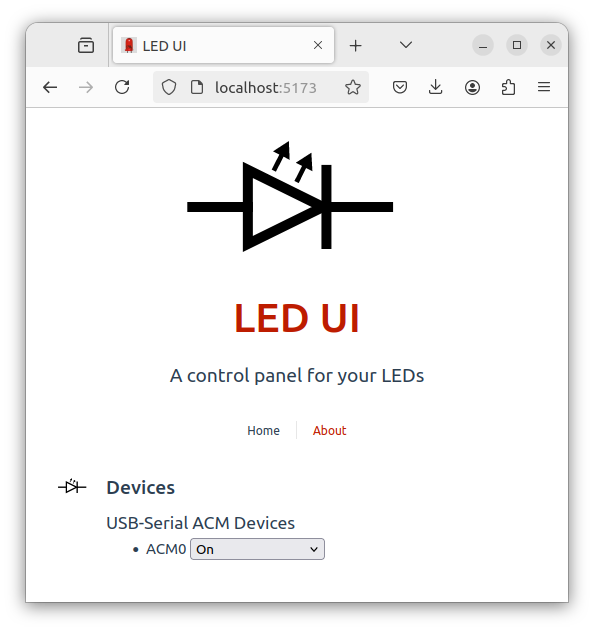

# LED UI System

This is a monorepo defining a very basic fullstack application with the following services (see individual READMEs for more details):

* [Client](./client/README.md): A VueJs application that allows a user to connect with a target device. The application logic is in `./client/components/DeviceControl.vue`
* [Server](./server/README.md): A Python Flask server that facilitates interactions between the client and the device.
* [Device](./device/README.md): A C++ application that will run on a target embedded device. Was supposed to be Rust, but I had a problem with USB-Serial input.

## Getting Started

In order to get started you will need a recent version of npm, Python, and Rust installed on your machine. You can then run `./script/setup` to install the basic dependencies for each project. There is also a `./script/start` script that will start each service as a separate process.

The `./script/test` runs server tests and an end-to-end test. To pass, at least one suitably programmed USB device must be plugged in.

## Requirements

1. For each device matching `/dev/ttyACM*`, a menu appears in the client UI.
2. The client should show the state of the device's LED as indicated by the device state in the API.
   - TODO Interrogate the device for the initial state and select the corresponding option.
3. The client should allow the user to toggle an LED on the device by sending a request to a new API endpoint you define on the server. The updated LED state should be reflected in the UI.
   - The newly defined endpoint should communicate with the device over a serial connection to toggle the LED state. The device should respond with the new state of the LED, which should in turn be returned to the client.
   - The device application must communicate over a serial connection on the development board, and should change the state of one of a GPIO on the board.

### Bonus

1. Move the embedded serial handling into separate task(s)/thread(s) so it does not block the main execution loop.
   - Not done.
2. The demo client is super ugly. Make it look less bad!
   - It looks less bad. To really show off, it would help to have a bigger problem with more content to organize and layout. For what it's worth, I added some svg art and a favicon.
3. Determine the available device(s) dynamically in the API.
   - The device I'm using enumerates as /dev/ttyUSB_n_ on Linux. The Python code uses a glob expression for enumeration.
4. Add an additional control to the UI that allows the user to set a blink rate for the button. This can be a text input, toggle, slider, etc. The device should then blink the LED at the specified rate.
   - The Desk Light device already had an alarm command that blinks the LEDs at a fixed frequency, so I included this. I could use a slider to control the pitch of a tone for the piezo speaker.

## Assesment Criteria

The goal of this exercise is to show us your ability to write production code in various parts of the stack. It's more important to write good, clean code than to complete all the requirements. Things we will be looking for:

- Well-structured, clean code
  - For simple applications, I avoid premature abstraction and excessive modularity. These become critically important for more complicated applications, but if we overdo them from the outset, they create overhead and incur the risk that we guess wrong about how things should be organized
- Helpful comments and documentation
  - I'm a big proponent of good documentation. If it's difficult to document something, this is a valuable clue that the design may be fraught. Organizations that refuse to document struggle to scale. Either the experienced developers' productivity suffers because they spend so much time explaining the code, or newer developers struggle to reverse engineer the existing code, and often miss implicit architectural constraints, leading to accidental tech debt.
- Tests where appropriate
  - When time is limited, end-to-end tests and blackbox tests provide more value than unit tests. Elaborate mock interfaces now common for web framework projects may not provide enough return on investment, especially at first. We should start by asking, "What's are simplest tests that would spare us from overlooking an abject failure?" As the system becomes larger, unit tests help us automatically narrow the search space for defects.

