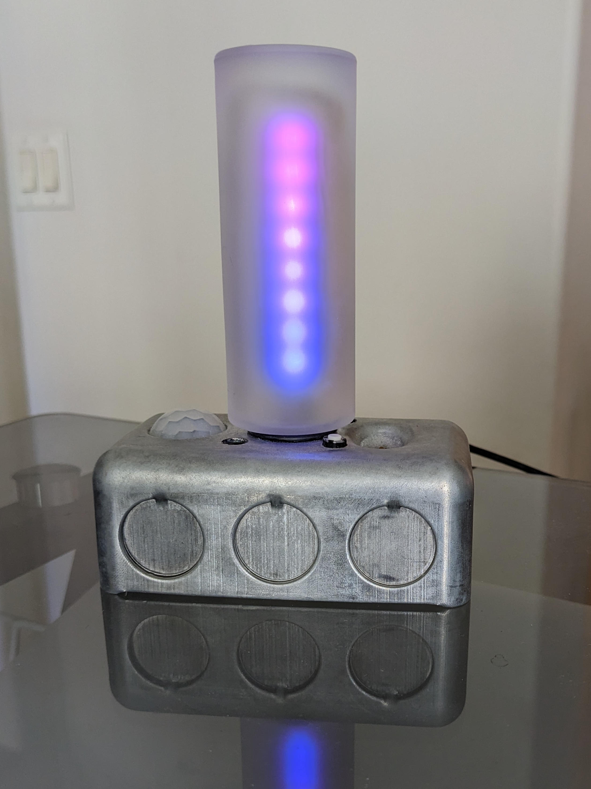
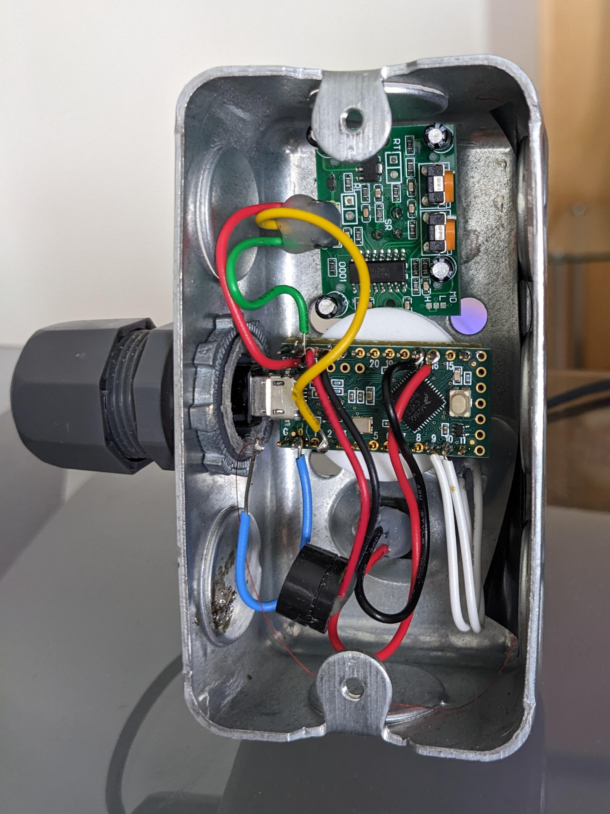

# Desk Light

Desk Light is a small Arduino one-off microcontroller project for my desk. I use it as a prototyping platform for my other microcontroller projects and as a decorative element on my desk.

## Description
The project combines the following hardware elements
- [PJRC Teensy LC microcontroller](https://www.pjrc.com/teensy/teensyLC.html)
- [Pimoroni Blinkt! eight APA102 RGB LED board](https://shop.pimoroni.com/products/blinkt?variant=22408658695)
- [PIR motion sensor](https://www.amazon.com/gp/product/B07DC4Z4QV/ref=ppx_yo_dt_b_search_asin_title?ie=UTF8&psc=1)
- [Silicon NPN phototransistor](https://www.digchip.com/datasheets/download_datasheet.php?id=192120&part-number=BPX81)
- [piezoelectric PC speaker](https://www.amazon.com/gp/product/B00QK1K2DS/ref=ppx_yo_dt_b_search_asin_title?ie=UTF8&psc=1)
- [small galvanized steel electrical box](https://www.homedepot.com/p/Steel-City-1-Gang-4-in-2-1-8-in-D-New-Work-Metal-Utility-Box-5837112-25R/202590841)
- frosted glass jar
- momentary push button
- assorted plastic, fiberglass boards, wire, glue

The software is built on [Arduino](https://www.arduino.cc/en/software) and [Teensyduino](https://www.pjrc.com/teensy/td_download.html). Libraries include Bounce2, [FastLED](https://github.com/FastLED/FastLED), and [InternalTemperature](https://github.com/LAtimes2/InternalTemperature).

## Installation
- Install Arduino
- Install Teensyduino
- Install the udev rules to enable USB Serial
- Open desklight.ino Arduino C++ file
- Select Teensy LC
- Add the InternalTemperature library

## Usage
Communicate with the board through USB serial at `/dev/ttyACM0` (or more generally `/dev/ttyACMn` for some number _n_ depending on the number of ACM devices plugged in before this one).

The bash script devcmd shows how to send commands to the Teensy LC and get output.

## Support
I'll answer questions as best I can. 

## Roadmap
Desklight is a one-off project and the microcontroller I used is no longer in production. It wouldn't be difficult to port this project to a more modern Teensy
- Add a level shifter for the APA102 LEDs
- Implement an alternate approach to capacitive touch sensing (modern Teensy microcontrollers do not have this hardware built in)

## Construction
The idea of an LED strip inside frosted glass was the inspiration for the project. The electrical box was selected for its industrial style and because it was inexpensive.
- The plastic lid of the frosted glass jar is used to hold the jar upright on the electric box.The jar can be unscrewed from the lid. The black o-ring stablizes the jar and adds a little visual detail
- The LED PCB is supported by a U-shaped piece of coathanger wire that's soldered to a piece of perfboard. The perfboard is mounted to the Teensy LC with pin headers. Epoxy might have been better a better way to attach the coathanger wire to the perfboard
The LED strip is diffused by several layers of white LDPE from thin drinking straws from juice boxes slit along their length. They are stretched over the LEDs and don't require glue or other mechanical attachment
- The finish of the electrical box was achieved using a rotary tool with a wire brush attachment
- The photodiode was soldered to a small square of thin fiberglass and glued with cyanoacrylate to the electrical box. Same technique was used for the momentary push button
- Blobs of hot melt glue provide strain relief to the wire connections
- Might have been better to mount the PIR sensor facing forward

## Contributing
If you decide to assemble compatible hardware to run this software, I'd love to hear about it and see pictures/videos. If you follow my pinout, I'd be open to pull requests, but open an issue first so we can discuss.

## Project status
This repository documents a toy I made for myself. I'd be delighted if you found any of it useful or interesting. I don't expect to put much more time into it in the forseeable future, but maybe I could be talked into something.